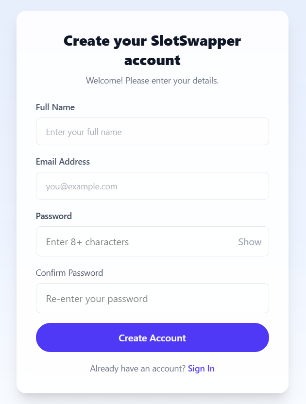
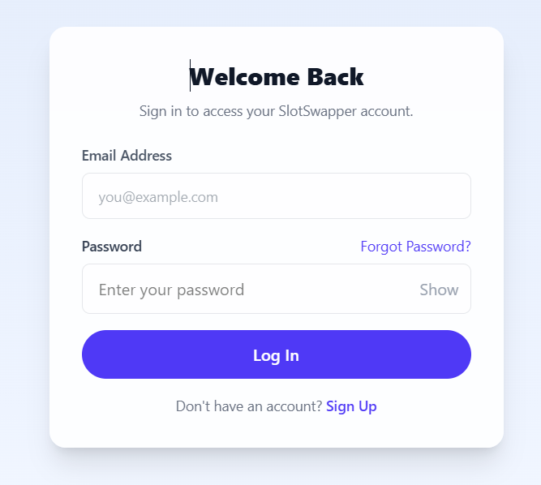
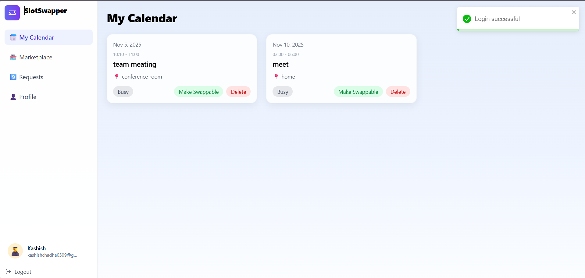
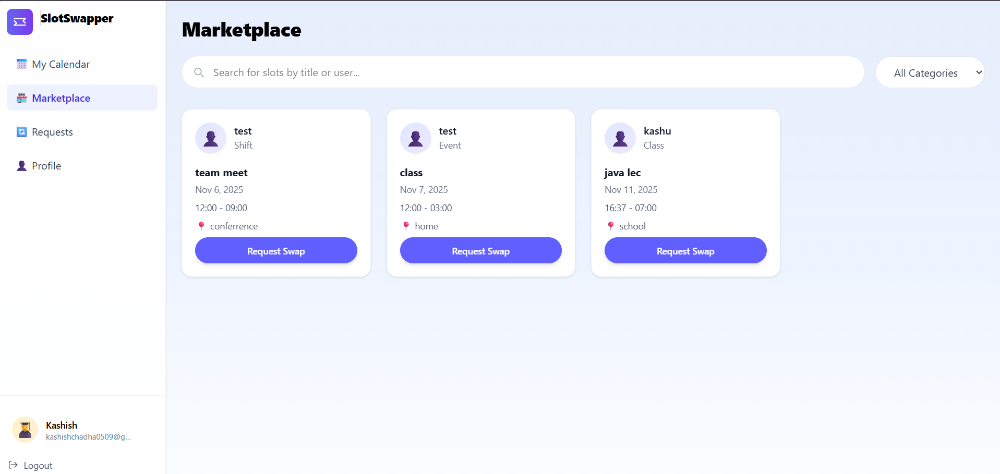
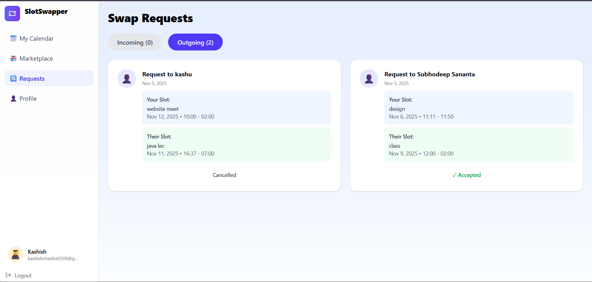
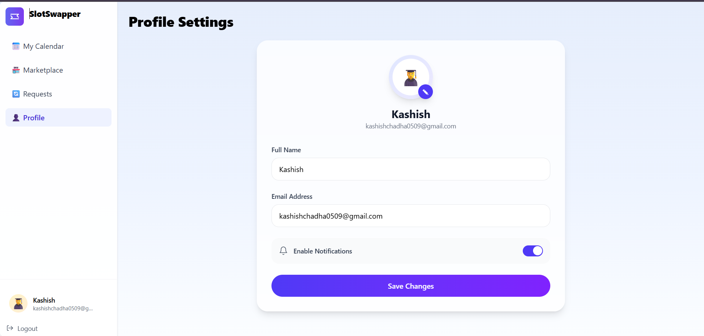

<div align="center">

  <h1>SlotSwapper</h1>
  <p><strong>A simple, modern app for swapping & managing time slots</strong></p>

  <p>
    
    
    
    
  </p>

  <p>
    <a href="#features">✨ Features</a> •
    <a href="#tech-stack">🛠️ Tech Stack</a> •
    <a href="#installation">⚡ Installation</a> •
    <a href="#api-routes">🔌 API Routes</a> •
    <a href="#contributing">🤝 Contributing</a>
  </p>
</div>

---

## 📖 About

SlotSwapper is a lightweight application designed to let users create, manage, and swap time slots (for example, lab/tutorial slots, meeting rooms, or appointment slots). It aims to provide a simple UI for listing available slots, requesting swaps, and tracking approvals — while offering a clean developer-friendly architecture.

> Note: This README is a full, ready-to-use template. If you'd like, I can inspect the repository and adapt this file to match the exact code, routes and environment variables used in your repository.

### 🎯 Key Highlights
- Create, list and search time slots
- Request swaps between users
- Approve / decline swap requests (roles/permissions)
- User authentication (JWT / session)
- Responsive UI and mobile-friendly views
- Persisted data (MongoDB)

---

## ✨ Features

- Slot CRUD: create, read, update, delete slot entries
- Swap Requests: request a swap and notify the other user
- Notifications: basic swap request notifications (in-app or email)
- Authentication & Authorization: register, login, protected routes
- Search & Filters: find slots by time, date, location, or owner
- Pagination or Infinite Scroll for long lists (depending on frontend)

---

## 📸 Screenshots

<div align="center">

### 🏠 Signup


### ✍️ Signin


### 📖 Dashboard


### 📱 Marketplace


### 📱 Request


### 📱 Profile



</div>
---

## 🛠️ Tech Stack

The following is a recommended/typical stack for this kind of project. Replace or edit to match your repository's actual technologies.

Frontend
- React (Vite)
- React Router
- React Query / SWR (optional)
- Zustand / Redux (optional)
- Axios / Fetch
- CSS Modules / Tailwind / Styled Components

Backend
- Node.js
- Express.js
- MongoDB + Mongoose (or PostgreSQL + Prisma)
- JWT for auth
- bcrypt (password hashing)
- CORS, cookie-parser, express-fileupload (optional)

Dev / Ops
- Vite / Webpack
- ESLint / Prettier
- Deploy: Vercel / Netlify (frontend), Railway / Heroku (backend)

---

## 🚀 Installation

These steps assume a common monorepo layout with `client/` and `server/` (or `backend/`). Adjust paths to match your repository.

### Prerequisites
- Node.js v16+
- npm or yarn
- MongoDB (local or cloud)
- Git

### 1. Clone the repository
```bash
git clone https://github.com/kashishchadha/SlotSwapper.git
cd SlotSwapper
```

### 2. Backend Setup
```bash
cd backend         # or server/ (adjust if repo differs)
npm install
```

Create a `.env` file in the backend directory (example):
```env
PORT=5000
MONGODB_URI=mongodb+srv://<user>:<password>@cluster0.mongodb.net/slotswapper
JWT_SECRET=your_jwt_secret
EMAIL_SERVICE_API_KEY=...     # optional, if email notifications are implemented
FRONTEND_URL=http://localhost:5173
```

Start the backend:
```bash
npm run dev          # or `npm start` depending on package.json
```

### 3. Frontend Setup
```bash
cd ../client        # adjust if frontend folder has a different name
npm install
```

Create a `.env` file in the client directory (example):
```env
VITE_API_URL=http://localhost:5000
VITE_SOME_OTHER_KEY=...
```

Start the frontend:
```bash
npm run dev
```

Visit:
- Frontend: http://localhost:5173 (or the port Vite shows)
- Backend: http://localhost:5000

---

## 🔌 API Routes (example)

Adjust these to match your actual backend routes. If you want, I can scan your routes and generate this section automatically.

Auth
- POST /api/auth/register — register a new user
- POST /api/auth/login — log in (returns JWT/token)
- POST /api/auth/logout — logout / invalidate token

Slots
- GET /api/slots — list all slots (with pagination and filters)
- POST /api/slots — create a new slot (authenticated)
- GET /api/slots/:id — get slot details
- PUT /api/slots/:id — update slot (owner / admin)
- DELETE /api/slots/:id — delete slot (owner / admin)

Swap Requests
- POST /api/swaps — request a swap (authenticated)
- GET /api/swaps — list swap requests (for user / admin)
- PATCH /api/swaps/:id/approve — approve a swap
- PATCH /api/swaps/:id/decline — decline a swap

Users
- GET /api/users/:id — get user profile
- GET /api/users/:id/slots — get slots for a user

---

## 📁 Suggested Project Structure

```
SlotSwapper/
├── client/                 # Frontend (React/Vite)
│   ├── public/
│   ├── src/
│   │   ├── components/
│   │   ├── pages/
│   │   ├── hooks/
│   │   ├── api/
│   │   └── App.jsx
│   └── package.json
├── backend/                # Backend (Express)
│   ├── controllers/
│   ├── models/
│   ├── routes/
│   ├── middleware/
│   ├── utils/
│   └── index.js
├── .env.example
├── README.md
└── package.json (optional root)
```

---

## 🎛️ Environment Variables

Add a `.env.example` in your repo to make onboarding easier. Example variables:
- MONGODB_URI
- JWT_SECRET
- PORT
- VITE_API_URL (frontend)
- EMAIL_SERVICE_API_KEY (optional)

---

## 🧪 Scripts

Common scripts to include in package.json files:

Frontend (client/package.json)
```bash
npm run dev
npm run build
npm run preview
npm run lint
```

Backend (backend/package.json)
```bash
npm run dev   # nodemon
npm start
npm test
```

---

## 🤝 Contributing

Contributions are welcome — here are some guidelines:

1. Fork the repo
2. Create a feature branch:
   git checkout -b feature/your-feature
3. Commit your changes:
   git commit -m "Add feature"
4. Push and open a pull request

Please:
- Follow the existing code style
- Add tests for new features
- Keep commits small and descriptive

---

## 📝 License

This project is open source — add your license file (MIT is common).

---

## 🙏 Acknowledgments

Thanks to contributors and the open-source ecosystem. Replace with any project-specific shoutouts.

---

## 📞 Contact

Kashish Chadha — https://github.com/kashishchadha

---

Made with ❤️
